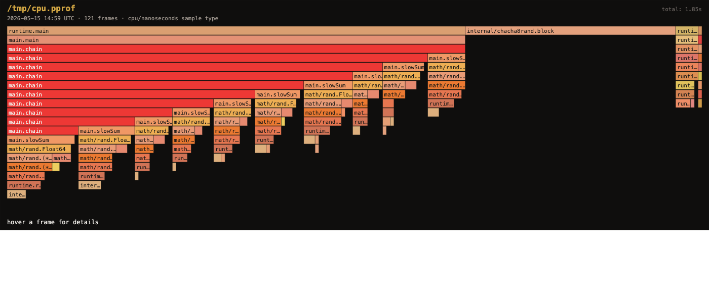

# flamectl

Render a [pprof](https://github.com/google/pprof) profile as a single-file interactive SVG flamegraph. Takes input from a file, an HTTP URL, or stdin. Output is one SVG you can open in any browser, with hover-to-inspect frames and no external dependencies.



## Install

```bash
go install github.com/c-tonneslan/flamectl@latest
```

Or build from this repo:

```bash
git clone https://github.com/c-tonneslan/flamectl
cd flamectl
go build .
```

## Use

```bash
# from a profile file
flamectl cpu.pprof
# wrote flame.svg

# from a running Go service exposing pprof endpoints
flamectl http://localhost:6060/debug/pprof/profile?seconds=10

# from stdin
go tool pprof -proto -seconds 5 http://localhost:6060/debug/pprof/profile | flamectl -

# list the sample types in a profile so you can pick the right one
flamectl --list-samples heap.pprof

# focus on a specific call (case-insensitive substring match)
flamectl --focus database/sql cpu.pprof

# pick a different sample dimension (e.g. cpu nanoseconds instead of sample count)
flamectl --sample 1 cpu.pprof
```

## Why this exists

`go tool pprof -http=:8080` is the official answer, and it's a great interactive explorer. But sometimes you want one of:

- A single static SVG you can attach to a GitHub issue or paste into a Slack message.
- A flamegraph from a profile someone sent you, without firing up the full pprof web UI.
- A scriptable way to render flamegraphs in CI, where Brendan Gregg's flamegraph.pl needs a pre-processing step.

flamectl is that. ~600 lines of Go, one binary, no UI server.

## How it works

1. Parse the pprof protobuf using `github.com/google/pprof/profile`.
2. Pick one of the sample-value dimensions (cpu nanoseconds, alloc objects, etc).
3. Walk every sample, reverse the stack so the entry point is at the root, aggregate values into a call tree.
4. Recursively lay out the tree: each node's width is its share of its parent's value; depth = vertical position; subtrees stack horizontally.
5. Emit one self-contained SVG with embedded CSS and a tiny inline script that updates a "current frame" status line on hover.

Colors are a deterministic FNV hash of the function name mapped into the warm-red-orange-yellow palette that's traditional for CPU flamegraphs. Two functions with the same name always get the same color across runs, which makes diffing two flamegraphs by eye a lot easier.

## What it doesn't do

- **No flame*chart* (sorted-by-time-axis) mode.** Just flame*graph*s.
- **No collapse-and-drill-down interaction in the SVG.** The output is intentionally static-with-hover; if you want full drill-down, use `go tool pprof -http=:8080`.
- **No symbolization beyond what pprof embeds.** If the profile was recorded without symbols, you'll see addresses.
- **No diff mode (yet).** Would be useful, isn't here.

## Stack

Pure Go. The only third-party dependency is `github.com/google/pprof/profile`, which is the same parser the official tool uses. SVG generation is hand-written.

MIT. Built by [Charlie Tonneslan](https://c-tonneslan-portfolio.vercel.app/).
